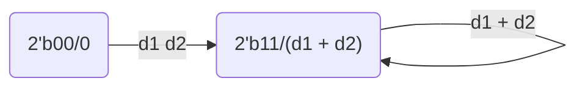

# 计算机组成原理 **实验报告**

> 姓名：张艺耀
>
> 学号：PB20111630 
>
> 实验日期：2022-3-15
> 
## 实验题目

  运算器及其应用

## 实验目的

  设计一ALU 实现算术逻辑运算功能；利用前述的ALU模块与适当的硬件电路，完成计算FLS的功能。

## 实验平台

FPGAOL  

Vivado

Mac + VSCode-remote + SSH + VLab

## 实验过程

### Step 1 ：32位操作数ALU

alu_32.v

```verilog
module alu_32 #(parameter WIDTH = 32)
(
    input [WIDTH - 1 : 0] a, b,
    input [2:0] f,
    output reg [WIDTH -1 : 0] y,
    output reg z
);

parameter ADD_32 = 3'b000;
parameter SUB_32 = 3'b001;
parameter AND_32 = 3'b010;
parameter OR_32 = 3'b011;
parameter XOR_32 = 3'b100;

always @(*) begin
    case (f)
        ADD_32: y = a + b;
        SUB_32: y = a - b;
        AND_32: y = a & b;
        OR_32:  y = a | b;
        XOR_32: y = a ^ b;
        default: y = 1'b0;
    endcase
end 

always @(*) begin
    if(y == 1'b0)
        z = 1'b0;
    else 
        z = 1'b1;
end

endmodule
```

test_bench.v（仿真文件）

```verilog
module test_bench #(parameter WIDTH = 32) ();
reg [WIDTH - 1 : 0] a, b;
reg [2:0] f;
wire [WIDTH -1 : 0] y;
wire z;
alu_32 alu_32(a, b, f, y, z);
initial begin
    a = 32'h3; b = 32'h5; f = 3'h0;
    #20 a = 32'h3; b = 32'h5; f = 3'h1;
    #20 a = 32'h3; b = 32'h5; f = 3'h2;
    #20 a = 32'h3; b = 32'h5; f = 3'h3;
    #20 a = 32'h3; b = 32'h5; f = 3'h4;
    #20 $finish;
end

endmodule
```

仿真结果如下：


与试验预期相符。

RTL电路：


综合电路：


资源使用情况：


时间性能：


## Step 2 : 6位操作数ALU

alu_6.v

`chmod 777 alu_6.v`更改为只读（ssh）

按照电路图先设计一个译码器模块（decoder）选择使能f 、a或是b，这里注意ef ea eb在主模块中为线网型变量。alu_6模块在复用decoder模块之后通过与alu_32相似的运算单元进行计算和零判断。由于电路图上是时序逻辑控制yout和zout输出故增设这两个变量以使输出更新与时钟同步。

```verilog
module decoder
(
    input en,
    input [1:0]sel,
    output reg ea, eb, ef
);
always @(*) begin
    if(en) begin
        case (sel)
            2'b00: begin
                ea = 1'b1;
                eb = 1'b0;
                ef = 1'b0;
            end
            2'b01: begin
                ea = 1'b0;
                eb = 1'b1;
                ef = 1'b0;
            end
            2'b10: begin
                ea = 1'b0;
                eb = 1'b0;
                ef = 1'b1;
            end
            default: begin
                ea = 1'b0;
                eb = 1'b0;
                ef = 1'b0;
            end
        endcase
    end
    else begin
        ea = 1'b0;
        eb = 1'b0;
        ef = 1'b0;
    end
end
endmodule

module alu_6 # (
    parameter ADD_6 = 3'b000,
    parameter SUB_6 = 3'b001,
    parameter AND_6 = 3'b010,
    parameter OR_6 = 3'b011,
    parameter XOR_6 = 3'b100
)
(
    input clk,
    input en,
    input [1:0] sel,
    input [5:0] x,
    output reg [5:0] y,
    output reg z
);

reg [2:0] fr;
reg [5:0] ar;
reg [5:0] br;
wire ea;
wire eb;
wire ef;
reg [5:0] yout;
reg zout;

decoder decoder(en, sel, ea, eb, ef);

always @(posedge clk) begin
    if(ea) ar <= x;
    else if(eb) br <= x;
    else if(ef) fr <= x[2:0];
    else begin
        ar <= ar;
        br <= br;
        fr <= fr;
    end
end

always @(*) begin
    case (fr)
        ADD_6: y = ar + br;
        SUB_6: y = ar - br;
        AND_6: y = ar & br;
        OR_6:  y = ar | br;
        XOR_6: y = ar ^ br;
        default: y = 6'b0;
    endcase
end

always @(*) begin
    if(y == 6'b0)
        z = 1'b0;
    else 
        z = 1'b1;
end

always @(posedge clk) begin
    yout <= y;
    zout <= z;
end
endmodule
```

烧写到FPGAOL平台上结果与预期相符。

RTL电路图：


资源使用情况：


时间性能：


时间性能与自行输入的输入输出延迟有关 若输入输出延迟均改为0：


### Step 3 : FLS

设置两个状态：

1. 接收前两个数的状态RECV_D（状态码2'b00）代表d1和d2
2. 进入执行状态EXECUTE（状态码2'b01）

状态图如下：



代码如下：

FLS.v

首先用一个取边沿函数**signal_egde**取按钮信号的边沿防止发送的按钮信号持续多个时钟周期。设置上述的两个状态参数RECV_D和EXECUTE。维护一个**cnt**变量用于判断是否该进入EXECUTE阶段。通过7位运算器计算斐波那契数列第一个变量与第二个变量的和存到d_sum中。

整个代码采用三段式FSM。组合逻辑用于进行生成下一周期的时钟状态；第一个时序逻辑用于产生将次态赋值给现态；第二个时序逻辑用于在时钟信号边沿输出f并进行必要的计算。

```verilog
module signal_edge (
    input clk,
    input button,
    output button_edge
);
reg button_r1,button_r2;

always@(posedge clk)
    button_r1 <= button;

always@(posedge clk)
    button_r2 <= button_r1;

assign button_edge = button_r1 & (~button_r2);

endmodule

module fls #(
    parameter RECV_D = 2'b00,
    parameter EXECUTE = 2'b01
)
(
    input clk, rst, en,
    input [6:0] d,
    output reg [6:0] f
);

reg [1:0] cs;
reg [1:0] ns;
reg [6:0] d_bef;
reg [6:0] d_nxt;
reg [2:0] cnt;
wire [6:0] d_sum;
wire z;
wire button_edge;

alu_7 alu(d_bef, d_nxt, 3'b000, d_sum, z);
signal_edge signal_edge(clk, en, button_edge);

initial begin
    cnt <= 2'b0;
end

always @(*) begin
    case(cs)
        RECV_D: begin
            if(cnt == 2'b10) ns = EXECUTE;
            else ns = RECV_D;
        end
        EXECUTE: begin
            ns = EXECUTE;
        end
        default: ns = RECV_D;
    endcase
end

always @(posedge clk) begin
    if(rst) cs <= RECV_D;
    else cs <= ns;
end
  
always @(posedge clk) begin
    if(rst) begin
        cnt <= 2'b0;
        f <= 7'b0;
        d_bef <= 7'b0;
        d_nxt <= 7'b0;
    end 
    else if(button_edge) begin
        case (cs)
            RECV_D: begin
                if(cnt == 2'b00) begin 
                    f <= d;
                    d_bef <= d;
                end
                else begin
                    f <= d;
                    d_nxt <= d;
                end
                cnt <= cnt + 1;
            end
            EXECUTE: begin
                d_bef <= d_nxt;
                f <= d_sum;
                d_nxt <= d_sum;
            end
            default: begin
                cnt <= 2'b0;
                f <= 7'b0;
                d_bef <= 7'b0;
                d_nxt <= 7'b0;
            end
        endcase
    end
end

endmodule
```

alu_7.v

```verilog
module alu_7 #(parameter WIDTH = 7)
(
    input [WIDTH - 1 : 0] a, b,
    input [2:0] f,
    output reg [WIDTH -1 : 0] y,
    output reg z
);

parameter ADD_32 = 3'b000;
parameter SUB_32 = 3'b001;
parameter AND_32 = 3'b010;
parameter OR_32 = 3'b011;
parameter XOR_32 = 3'b100;

always @(*) begin
    case (f)
        ADD_32: y = a + b;
        SUB_32: y = a - b;
        AND_32: y = a & b;
        OR_32:  y = a | b;
        XOR_32: y = a ^ b;
        default: y = 32'b0;
    endcase
end 

always @(*) begin
    if(y == 32'b0)
        z = 1'b1;
    else 
        z = 1'b0;
end

endmodule
```

## 实验结果

alu_32的仿真波形图已在实验过程中贴出。

**alu_6 FPGAOL运行结果：**

​	第一个操作数是1：


​	第二个操作数是2：


​	使用加法 结果为3：

**FLS运行结果：**

​	输入 1 2后按下button：3

5

8

## 心得体会

这次实验相当于一次复建。通过此次实验，我将自己在上学期学习的verilog知识巩固了一遍、重新学习了仿真文件的写法、加深了对有限状态机的理解和对线网型和寄存器型变量之间的区别的理解。但自己仍不太明白一些函数调用的端口输入输出变量的类型的区别，比如某个模块输出变量类型的不同对整个电路的布局有怎样的影响等等。同时我在对vivado的使用上有些生疏，百度等搜索引擎对vivado操作的讲解也很少，部分问题询问助教后才得以解决。比如在Vlab虚拟机上生成timing summary时出现了一系列问题，如需要手动设置约束文件为top等一些复杂的操作。由于对计算机时间缺乏概念，其生成的summary多半不明白。

一些建议：希望在以后的ppt中能增添一些对这块的详细操作指导和Q&A模块 （汇总学生做实验过程中遇到的问题附上解决方案等）。
