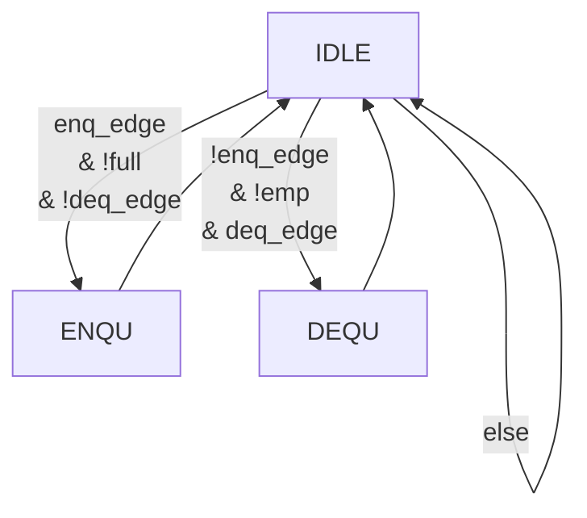

# 计算机组成原理 **实验报告**

> 姓名：张艺耀
>
> 学号：PB20111630 
>
> 实验日期：2022-3-22 
> 
## 实验题目

寄存器堆与存储器及其应用

## 实验目的

+ 掌握寄存器堆和存储器的功能、时许及其应用

+ 熟练掌握数据通路和控制器的设计和描述方法


## 实验平台

+ FPGAOL  

+ Vivado

+ Mac + VSCode-remote + SSH + VLab

## 实验过程

### Step 1 : 行为方式参数化描述寄存器堆 功能仿真

本步骤要求实现一个32*WIDTH的寄存器并进行功能仿真。

register_file.v

```verilog
module register_file #(parameter WIDTH = 32) (
    input clk, 
    input [4:0] ra0,    //读端口0地址
    output [WIDTH - 1:0] rd0,   //读端口0数据
    input [4:0] ra1,    //读端口1地址
    output [WIDTH - 1:0] rd1,   //读端口1数据
    input [4:0] wa, //写端口地址
    input we,   //写使能 高电平有效
    input [WIDTH - 1:0] wd //写端口数据
);

reg [WIDTH - 1:0] regfile [0:31];
assign rd0 = regfile[ra0];
assign rd1 = regfile[ra1];

always @(posedge clk) begin
    if(we) regfile[wa] <= wd;
end

endmodule
```

仿真文件test_bench.v：

```verilog
module test_bench #(parameter WIDTH = 32) ();
reg clk; 
reg [4:0] ra0;    //读端口0地址
wire [WIDTH - 1:0] rd0;   //读端口0数据
reg [4:0] ra1;    //读端口1地址
wire [WIDTH - 1:0] rd1;   //读端口1数据
reg [4:0] wa; //写端口地址
reg we;   //写使能 高电平有效
reg [WIDTH - 1:0] wd; //写端口数据
register_file register_file(clk, ra0, rd0, ra1, rd1, wa, we, wd);

initial begin
    clk = 1'b1;
    forever #10 clk = ~clk;
end

initial begin
    we = 1'b1;
    ra0 = 5'b0;
    wa = 5'b0;
    wd = 31'b1010;
    #31 wa = 5'b10; ra1 = 5'b10; wa = 5'b10; wd = 31'b0101;
    #21 we = 1'b0; $finish;
end

endmodule
```

仿真结果：


可以看出初始时先向寄存器地址0中写入a（31'b1010）ra0 读出数据；31ns之后向地址2中写入5（31'b0101）ra1读出数据。符合寄存器功能要求。

### Step 2 : IP例化分布式和块式16 * 8 位单端口RAM 功能仿真和对比

按照实验文档所给步骤操作即可。

先把总的仿真文件test_bench.v放出来：

```verilog
//module test_bench ();

// RF_8_4.v test
/*
module test_bench ();
reg clk, rst; 
reg [2:0] ra0;    //读端口0地址
wire [3:0] rd0;   //读端口0数据
reg [2:0] ra1;    //读端口1地址
wire [3:0] rd1;   //读端口1数据
reg [2:0] wa; //写端口地址
reg we;   //写使能 高电平有效
reg [3:0] wd; //写端口数据
RF_8_4 RF_8_4(clk,rst, ra0, rd0, ra1, rd1, wa, we, wd);

initial begin
    rst = 0;
    clk = 1'b1;
    forever #5 clk = ~clk;
end

initial begin
    we = 1'b1;
    ra0 = 5'b0;
    wa = 5'b0;
    wd = 31'b1010;
    #31 wa = 5'b10; ra1 = 5'b10; wa = 5'b10; wd = 31'b0101;
    #21 we = 1'b0; #20 rst = 1;
    #20 $finish;
end

endmodule
*/

//blk_mem_gen_0.v test
/*
module test_bench ();
reg clka;
reg ena;
reg wea;
reg [3:0] addra;
reg [7:0] dina;
wire [7:0] douta;
blk_mem_gen_0 blk_mem_gen_0(clka, ena, wea, addra, dina, douta);

initial begin
    clka = 1'b1;
    forever #5 clka = ~clka;
end

initial begin
    ena = 1'b1;
    wea = 1'b0;
    addra = 1'b0;
    while (addra < 15) begin
        #10 addra = addra + 1'b1;
    end
    wea = 1'b1;
    addra = 4'hf;
    dina = 8'b0;
    #10 wea = 1'b0; addra = 4'h0; #20 $finish;
end

endmodule

*/

//dist_mem_gen_0.v test
/*
module test_bench ();
reg [3:0] a;    //端口地址
reg [7:0] d;    //端口数据
reg clk;
reg we;
wire [7:0] spo;
dist_mem_gen_0 dist_mem_gen_0(a, d, clk, we, spo);

initial begin
    clk = 1'b1;
    forever #10 clk = ~clk;
end

initial begin
    we = 1'b0;
    a = 1'b0;
    while (a < 15) begin
        #10 a = a + 1'b1;
    end
    we = 1'b1;
    a = 4'hf;
    d = 8'b0;
    #10 we = 1'b0; a = 4'h0; #20 $finish;
end

endmodule
*/

//register_file.v test
/*
module test_bench #(parameter WIDTH = 32) ();
reg clk; 
reg [4:0] ra0;    //读端口0地址
wire [WIDTH - 1:0] rd0;   //读端口0数据
reg [4:0] ra1;    //读端口1地址
wire [WIDTH - 1:0] rd1;   //读端口1数据
reg [4:0] wa; //写端口地址
reg we;   //写使能 高电平有效
reg [WIDTH - 1:0] wd; //写端口数据
register_file register_file(clk, ra0, rd0, ra1, rd1, wa, we, wd);

initial begin
    clk = 1'b1;
    forever #10 clk = ~clk;
end

initial begin
    we = 1'b1;
    ra0 = 5'b0;
    wa = 5'b0;
    wd = 31'b1010;
    #31 wa = 5'b10; ra1 = 5'b10; wa = 5'b10; wd = 31'b0101;
    #21 we = 1'b0; $finish;
end

endmodule
*/
```

#### 分布式：

dist_mem_gen_0_stub.v

```verilog
module dist_mem_gen_0(a, d, clk, we, spo)
/* synthesis syn_black_box black_box_pad_pin="a[3:0],d[7:0],clk,we,spo[7:0]" */;
  input [3:0]a;
  input [7:0]d;
  input clk;
  input we;
  output [7:0]spo;
endmodule
```

test_bench.v

```verilog
module test_bench ();
reg [3:0] a;    //端口地址
reg [7:0] d;    //端口数据
reg clk;
reg we;
wire [7:0] spo;
dist_mem_gen_0 dist_mem_gen_0(a, d, clk, we, spo);

initial begin
    clk = 1'b1;
    forever #10 clk = ~clk;
end

initial begin
    we = 1'b0;
    a = 1'b0;
    while (a < 15) begin
        #10 a = a + 1'b1;
    end
    we = 1'b1;
    a = 4'hf;
    d = 8'b0;
    #10 we = 1'b0; a = 4'h0; #20 $finish;
end

endmodule
```

reg1.coe

```
memory_initialization_radix = 16;
memory_initialization_vector = 
0 1 2 3 4 5 6 7 8 9 a b c d e f;
```

仿真结果：


#### 块式：

blk_mem_gen_0_stub.v

```verilog
module blk_mem_gen_0(clka, ena, wea, addra, dina, douta)
/* synthesis syn_black_box black_box_pad_pin="clka,ena,wea[0:0],addra[3:0],dina[7:0],douta[7:0]" */;
  input clka;
  input ena;
  input [0:0]wea;
  input [3:0]addra;
  input [7:0]dina;
  output [7:0]douta;
endmodule
```

test_bench.v

```verilog
module test_bench ();
reg clka;
reg ena;
reg wea;
reg [3:0] addra;
reg [7:0] dina;
wire [7:0] douta;
blk_mem_gen_0 blk_mem_gen_0(clka, ena, wea, addra, dina, douta);

initial begin
    clka = 1'b1;
    forever #10 clka = ~clka;
end

initial begin
    ena = 1'b1;
    wea = 1'b0;
    addra = 1'b0;
    while (addra < 15) begin
        #10 addra = addra + 1'b1;
    end
    wea = 1'b1;
    addra = 4'hf;
    dina = 8'b0;
    #10 wea = 1'b0; addra = 4'h0; #20 $finish;
end

endmodule
```

reg1.coe

```
memory_initialization_radix = 16;
memory_initialization_vector = 
0 1 2 3 4 5 6 7 8 9 a b c d e f;
```

仿真结果：


此时意识到时钟周期不合适。将时钟频率更改为原来的两倍`#5 clka = ~clka`得到的仿真波形图如下：可以看出douta在下一个时钟周期更新读入上一个地址里的值。


由此可以发现BRAM和DRAM的区别：**BRAM读、写均和时钟同步，而DRAM写和时钟同步，读不需要时钟**。

### Step3 : FIFO队列

fifo.v : 

fifo队列主模块 将三个分模块联结起来。

```verilog
module fifo (
    input clk, rst, enq,    //时钟（上升沿有效） 同步复位（高电平有效） 入队列使能（高电平有效）
    input [3:0] in, //入队列数据
    input deq,  //出队列使能（高电平有效）
    output [3:0] out,   //出队列数据
    output [2:0] an,    //数码管选择
    output [3:0] hexplay_data,    //数码管数据
    output full, emp
);

wire [2:0] ra0; wire [2:0] ra1;
wire [3:0] rd0; wire [3:0] rd1;
wire [2:0] wa; wire we; wire [3:0] wd; wire [7:0] valid;

lcu lcu(in, enq, deq, clk, rst, rd0, out, full, emp, ra0, wa, we, wd, valid);
RF_8_4 RF_8_4(clk, rst, ra0, rd0, ra1, rd1, wa, we, wd);
  sdu sdu(rd1, valid, clk, emp, ra1, an, hexplay_data);

endmodule
```

lcu.v : 

队列控制单元lcu。

设置了三个状态，分别是**闲置模式、入队列和出队列**。维护两个指针head和tail用来指示队头队尾，两个变量full和emp用来指示队列是否满/空 ：`full <= (tail + 1'b1 == head) ? 1'b1 : 1'b0;` 和 `emp <= (tail == head + 1'b1) ? 1'b1 : 1'b0;`。34～39行是取开关上升沿的模块，之后采用三段式FSM实现主体逻辑功能。

**状态图 ：**




```verilog
module lcu (
    input [3:0] in,
    input enq, deq, clk, rst,
    input [3:0] rd0,
    output [3:0] out,
    output reg full, emp,
    output reg [2:0] ra0,
    output reg [2:0] wa,
    output reg we, 
    output reg [3:0] wd,
    output reg [7:0] valid
);

reg [2:0] head;
reg [2:0] tail;

parameter IDLE = 2'b00;
parameter ENQU = 2'b01;
parameter DEQU = 2'b10;

reg [1:0] cs;
reg [1:0] ns;
reg tmp_1;
reg tmp_2;
reg enq_edge;
reg deq_edge;

initial begin
    cs <= 2'b0;
    ra0 <= 3'b0;
    valid <= 8'b0;
end

always @(posedge clk) begin
    tmp_1 <= enq;
    enq_edge <= enq & ~tmp_1;
    tmp_2 <= deq;
    deq_edge <= deq & ~tmp_2;
end

always @(*) begin
    case(cs)
        IDLE: begin
            if(enq_edge & !full & !deq_edge) ns = ENQU;
            else if(!enq_edge & !emp & deq_edge) ns = DEQU;
            else ns = IDLE;
        end
        ENQU: begin
            ns = IDLE;
        end
        DEQU: begin
            ns = IDLE;
        end
        default: ns = IDLE;
    endcase
end

always @(posedge clk) begin
    if(rst) begin
        head <= 3'b0;
        tail <= 3'b0;
        valid <= 8'b0;
        emp <= 1'b1;
        full <= 1'b0;
    end
    else begin
        case(cs)
            ENQU: begin
                we <= 1'b1;
                wa <= tail;
                wd <= in;
                valid[tail] <= 1'b1;
                tail <= tail + 1'b1;
                full <= (tail + 1'b1 == head) ? 1'b1 : 1'b0;
                emp <= 1'b0;
            end
            DEQU: begin
                ra0 <= head;
                valid[head] <= 1'b0;
                head <= head + 1'b1;
                emp <= (tail == head + 1'b1) ? 1'b1 : 1'b0;
                full <= 1'b0;
            end
            default: begin
                we <= 1'b0;
            end
        endcase
    end
end

always @(posedge clk) begin
    if(rst) cs <= IDLE;
    else cs <= ns;
end

assign out = rd0;

endmodule
```

RF_8_4.v : 

与之前的寄存器模块相比只增加了一个rst输入。

```verilog
module RF_8_4 (
    input clk, rst,
    input [2:0] ra0,    //读端口0地址
    output [3:0] rd0,   //读端口0数据
    input [2:0] ra1,    //读端口1地址
    output [3:0] rd1,   //读端口1数据
    input [2:0] wa, //写端口地址
    input we,   //写使能 高电平有效
    input [3:0] wd //写端口数据
);

reg [3:0] regfile [0:7];
assign rd0 = regfile[ra0];
assign rd1 = regfile[ra1];
integer i;

always @(posedge clk) begin
    if(rst) begin
        for(i = 0; i <= 7; i = i + 1) begin
            regfile[i] <= 4'b0;
        end
    end
    else if(we) regfile[wa] <= wd;
end

endmodule
```

​	sdu.v : 

添加了中间变量cnt以使valid为0时对应an位不显示数字。（这里本人进行了许多次尝试 即注释的内容。如果仅仅将an设置为线网类型变量并且直接用`assign an = ra1`和`assign hexplay_data = (valid[ra1]) ? rd1 : x0;`的话会导致队列以外的位置全为0而非空，这种情况下只有可以设置高阻态输出才是可行的；而如果使用`assign an = ra1 * valid[ra1]`的话会导致第0位显示值在队列满之前始终为0、在队列即将满时闪烁，在队列已满时才能正常显示。这是因为当valid中有0时赋给an[0]的值是不确定的）

最后多加了一个emp变量用于判断队列空时将输出置0（否则会显示留在队列里的数字）。

```verilog
/*
module sdu (
    input [3:0]rd1,//read data
    input [7:0]valid,
    input clk,
    output [2:0]ra1,//read address
    output [2:0]an,//segment address
    output [3:0]hexplay_data//segment data
);

reg [23:0] count;
wire [3:0] x0;
//wire [3:0] x1;

assign x0 = 4'h0;
//assign an = (valid[ra1]) ? ra1 : x1;
assign an = ra1;
assign ra1 = count[15:13];

always @(posedge clk) begin
    count <= count + 1;
end

assign hexplay_data = (valid[ra1]) ? rd1 : x0;

endmodule
*/

module sdu (
    input [3:0] rd1, 
    input [7:0] valid, 
    input clk, emp, 
    output [2:0] ra1, 
    output reg [2:0] an, 
    output reg [3:0] hexplay_data
);

reg [32:0] hexplay_cnt;
reg [2:0] cnt;

initial begin
    hexplay_cnt <= 0;
    cnt <= 0;
end

always @(*) begin
    if(emp) hexplay_data = 0;
    else hexplay_data = rd1;
end

always@(posedge clk) begin
    if (hexplay_cnt >= (2000000/8)) hexplay_cnt <= 0;
    else hexplay_cnt <= hexplay_cnt + 1;
end

always@(posedge clk) begin
    if (hexplay_cnt == 0) begin
        if(cnt == 7) cnt <= 0;
        else cnt <= cnt + 1;
				
      	if(emp) an <= 0;
        else if(valid[cnt]) an <= cnt;
    end
end

assign ra1 = an;

endmodule
```

### lcu改进

由于为了节省代码行数在FSM状态转换的过程中省略了ENQU状态和DEQU状态之后对自身的转换导致可能的连续执行出入队列操作不成功的问题，这样会导致在出入队列之后的一个时钟周期无法进行出入队列（但是在现实中这种问题可以忽略，因为实际操作开关的时间远大于时钟周期）

改进：

```verilog
always @(*) begin
    case(cs)
        IDLE: begin
            if(enq_edge & !full & !deq_edge) ns = ENQU;
            else if(!enq_edge & !emp & deq_edge) ns = DEQU;
            else ns = IDLE;
        end
        ENQU: begin
            if(enq_edge & !full & !deq_edge) ns = ENQU;
            else if(!enq_edge & !emp & deq_edge) ns = DEQU;
            else ns = IDLE;
        end
        DEQU: begin
            if(enq_edge & !full & !deq_edge) ns = ENQU;
            else if(!enq_edge & !emp & deq_edge) ns = DEQU;
            else ns = IDLE;
        end
        default: ns = IDLE;
    endcase
end
```


## 实验结果

仿真结果已经在实验过程中贴出。

fifo.bit烧写到FPGAOL上的结果 ：

初态：


1 3 7 F 9 9 9 9 入队列直至队列满

出队列

## 心得体会

实验的逻辑很简单，但是sdu的编写很让人头痛。

由于一开始不知道怎么样才能实现出队列时数码管上不显示值走了很多弯路。但是由于数码管总是有一个是亮的 这样还是无法完全做到队列空时8个管子完全没有值显示。

不过总地来说加深了自己对状态机的理解并提升了自己对一些显示bug的处理能力。
